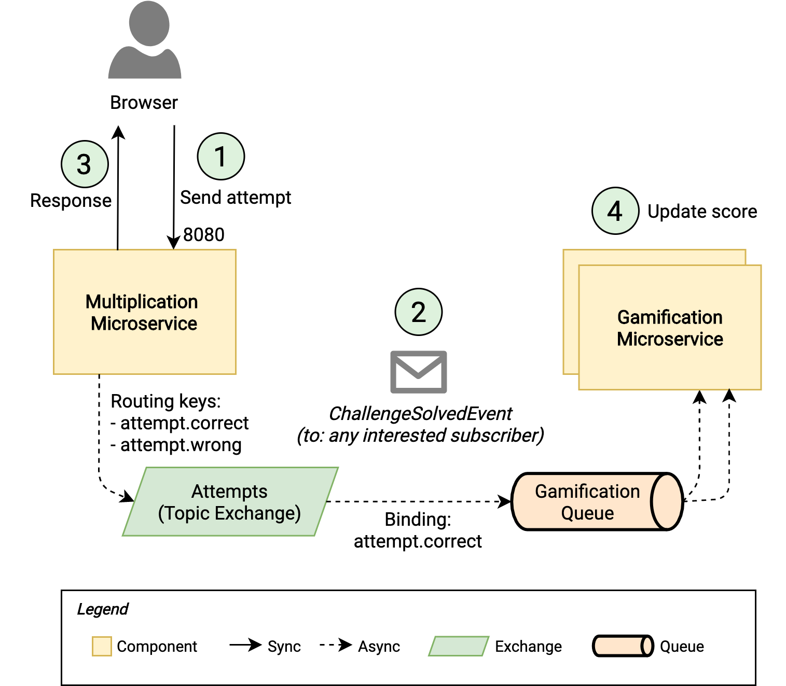
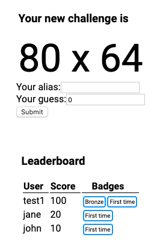

# Learn Microservices with Spring Boot 3 - Chapter 7
This repository contains the source code of the practical use case described in the book [Learn Microservices with Spring Boot 3 (3rd Edition)](https://link.springer.com/book/10.1007/978-1-4842-9757-5).
The book follows a pragmatic approach to building a Microservice Architecture. You start with a small monolith and examine the pros and cons that come with a move to microservices.

## Chapter 7 version

In Chapter 7, you learn how to achieve loose coupling with an Event-Driven Architecture using a **RabbitMQ message broker**. Besides, you go through the extra advantages like the ability to implement different messaging patterns, load balancing, and resilience. 



The main concepts included in this chapter are:

* Event-Driven Architectures: Pros and Cons
* Embracing Eventual Consistency, all the way up to the UI
* RabbitMQ main concepts, messaging patterns, and practical implementation
* Refactoring the microservices towards an Event-Driven strategy
* Resilience with persistent messages

As usual, the book uses this practical implementation to teach you why introducing a message broker between our microservices is a good idea. You learn the patterns before the tools, so you can use your knowledge to build similar architectures using a different technology stack - e.g. Kafka. 

## Running the app

Requirements:

* JDK 17
* Node.js v18.16.0
* npm 9.7.1
* RabbitMQ 3.12.2

1. You need a RabbitMQ server running. Run the server according to the instructions for your OS, for example:
    ```bash
    $ rabbitmq-server
    ```
1. To start the Multiplication microservice, you can use the command line with the included Maven wrapper:
    ```bash
    multiplication$ ./mvnw spring-boot:run
    ```
2. To start the Gamification microservice, you do the same from its corresponding folder:
    ```bash
    gamification ./mvnw spring-boot:run
    ```
2. The React application can be started with npm. First, you need to download the dependencies with:
    ```bash
    challenges-frontend$ npm install
    ```
3. Then, you start the server with:
    ```bash
    challenges-frontend$ npm start
    ```

Once the backend and the fronted are started, you can navigate to `http://localhost:3000` in your browser and start resolving multiplication challenges. This time, you'll see the Leaderboard.



## Questions

* Do you have questions about how to make this application work?
* Did you get the book and have questions about any concept explained within this chapter?
* Have you found issues using updated dependencies?

Don't hesitate to create an issue in this repository and post your question/problem there. 
## Purchase
You can buy the book online from these stores:
* [Apress](https://link.springer.com/book/10.1007/978-1-4842-9757-5)
* [Amazon](https://www.amazon.com/Learn-Microservices-Spring-Boot-Containerization/dp/1484297563)
and other online stores.
